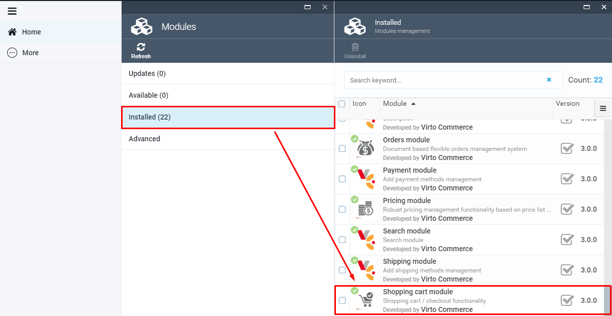
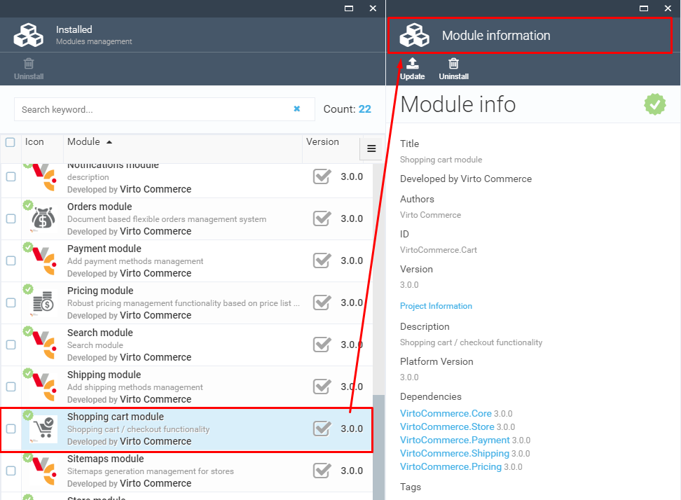

# Overview

    

VirtoCommerce.Cart module represents shopping cart management system. This module doesn't have any UI in VC Manager.

VirtoCommerce.Cart module manages customers accumulated list of items, calculates a total for the order, including shipping and handling (i.e., postage and packing) charges and the associated taxes.

## Key Features

1. Supports multiple carts - if the user is using more than one cart at the same time, all of the carts will be supported by VirtoCommerce.Cart module.

1. Named lists - the user can add the desired products to the  wishlist , which will be saved in the cart. The user can later use the products added to the wishlist to make an order. The wishlist details will be saved by the VirtoCommerce.Cart module.
1. Grouping multiple carts to one order - if the user is using more than one cart, the final order will be created by grouping the details from all the carts filled out by user.
1. Anonymous carts - the user can put products to cart and submit order anonymously, without creating an account.
1. Stock reservation - the selected products will be reserved in stock after adding them to the cart.
1. Multiple payments methods - the user can choose the payment methods he wants before checkout.
1. Create new cart from orders history - the user can add products to a new cart using the previously completed orders (orders history).

## Documentation

* [Cart Module Document](https://docs.virtocommerce.org/platform/user-guide/cart/overview/)

* [View on GitHub](https://github.com/VirtoCommerce/vc-module-cart/tree/dev)

## References

* Deploy: https://docs.virtocommerce.org/platform/developer-guide/Tutorials-and-How-tos/Tutorials/deploy-module-from-source-code/
* Installation: https://docs.virtocommerce.org/platform/user-guide/modules-installation/
* Home: https://virtocommerce.com
* Community: https://www.virtocommerce.org
* [Download Latest Release](https://github.com/VirtoCommerce/vc-module-cart/releases/)

## License

Copyright (c) Virto Solutions LTD.  All rights reserved.

Licensed under the Virto Commerce Open Software License (the "License"); you
may not use this file except in compliance with the License. You may
obtain a copy of the License at

http://virtocommerce.com/opensourcelicense

Unless required by applicable law or agreed to in writing, software
distributed under the License is distributed on an "AS IS" BASIS,
WITHOUT WARRANTIES OR CONDITIONS OF ANY KIND, either express or
implied.
