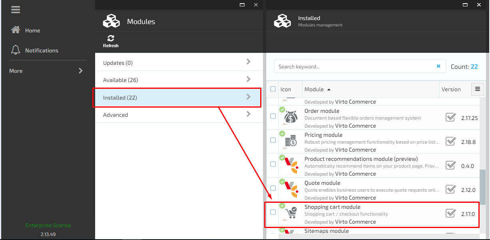
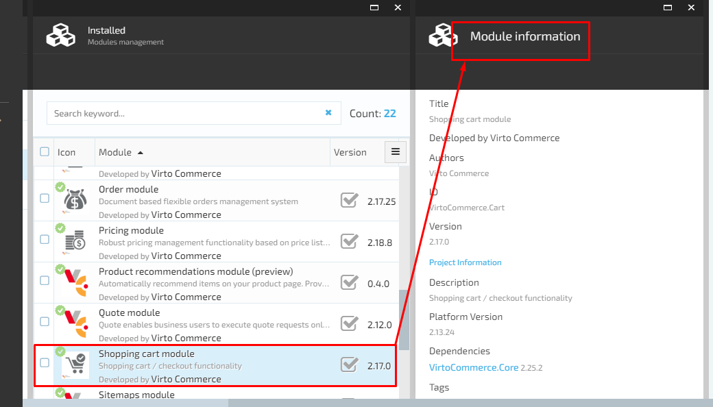

# VirtoCommerce.Cart

## Overview

VirtoCommerce.Cart module represents shopping cart management system. This module doesn't have any UI in VC Manager.

VirtoCommerce.Cart module manages customers accumulated list of items, calculates a total for the order, including shipping and handling (i.e., postage and packing) charges and the associated taxes.

## Features

1. Supports multiple carts- if the user is using more than one cart at the same time, all of the carts will be supported by VirtoCommerce.Cart module.

1. Wishlist-
the user can add the desired products to the  wishlist , which will be saved in the cart. The user can later use the products added to the wishlist to make an order. The wishlist details will be saved by the VirtoCommerce.Cart module.
1. Grouping multiple carts to one order-
If the user is using more than one cart, the final order will be created by grouping the details from all the carts filled out by user.
1. Anonymous carts-
the user is allowed to use an anonymous account, not necessarily to login under his own account. Such carts information will also be saved on the database by the cart module.
1. Stock reservation-
the selected products will be reserved in stock after adding them to the cart.
1. Multiple payments methods-
the user can choose the payment methods he wants before checkout.
1. Create new cart from orders history-
the user can add products to a new cart using the previously completed orders (orders history).

The main purpose of the VirtoCommerce.Cart module is to implement customer shopping cart management in VC eCommerce solution. It encapsulates data persistence, management services and exposes REST API endpoints.

The VirtoCommerce.Cart module is connected with the shopping cart API requests:

1. General API request that allows saving the entire shopping cart information on the database;
1. Specific API requests that allow call specific operations, for example delete, edit, choose payment method, choose delivery type, etc.

For more details about the available cart-module API, please follow the link bellow:

https://admin-demo.virtocommerce.com/docs/ui/index#/Shopping%2520cart%2520module

The VirtoCommerce.Cart module functionality can be extended and customized based on the specific business needs. In order to extend the cart module functionality, use "Virto Commerce 2.x Cart and Order Module extension" template that can be accessed by following the link below:

https://marketplace.visualstudio.com/items?itemName=Virto-Commerce.VirtoCommerceModuleTemplates

## Installation
Installing the module:
* Automatically: in VC Manager go to Configuration -> Modules -> Shopping cart module -> Install
* Manually: download module zip package from https://github.com/VirtoCommerce/vc-module-cart/releases. In VC Manager go to Configuration -> Modules -> Advanced -> upload module package -> Install.

## Available resources
* Module related service implementations as a <a href="https://www.nuget.org/packages/VirtoCommerce.CartModule.Data" target="_blank">NuGet package</a>
* API client as a <a href="https://www.nuget.org/packages/VirtoCommerce.CartModule.Client" target="_blank">NuGet package</a>
* API client documentation  https://admin-demo.virtocommerce.com/docs/ui/index#/Shopping%2520cart%2520module

## License
Copyright (c) Virto Solutions LTD.  All rights reserved.

Licensed under the Virto Commerce Open Software License (the "License"); you
may not use this file except in compliance with the License. You may
obtain a copy of the License at

http://virtocommerce.com/opensourcelicense

Unless required by applicable law or agreed to in writing, software
distributed under the License is distributed on an "AS IS" BASIS,
WITHOUT WARRANTIES OR CONDITIONS OF ANY KIND, either express or
implied.
